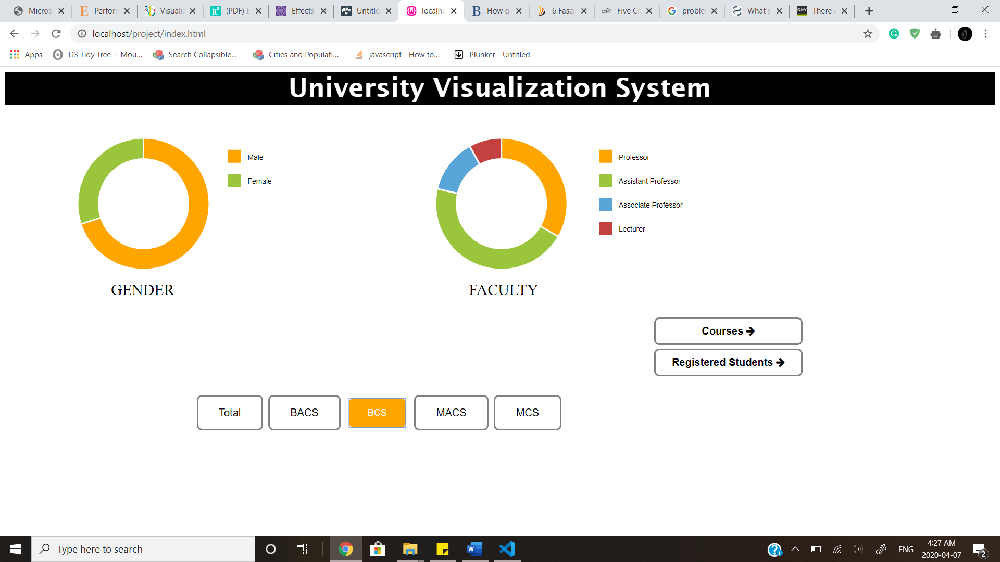
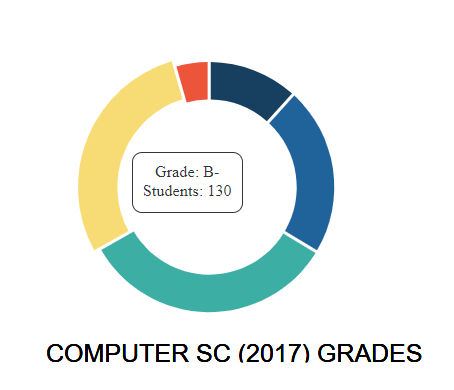
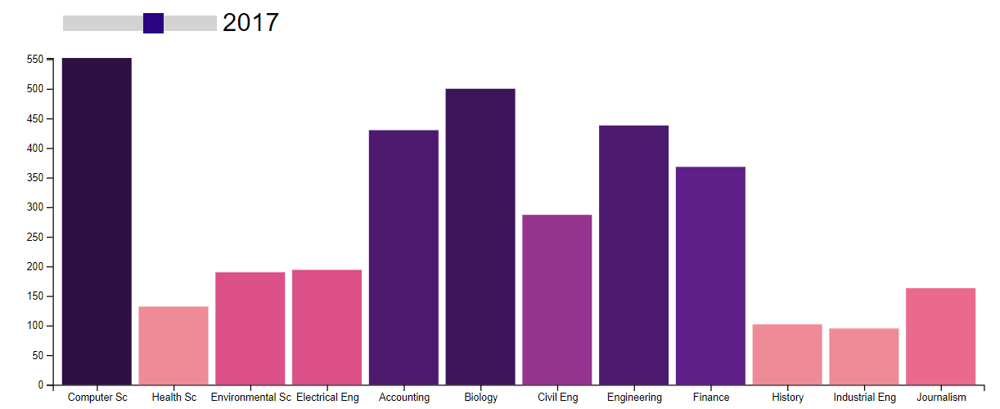
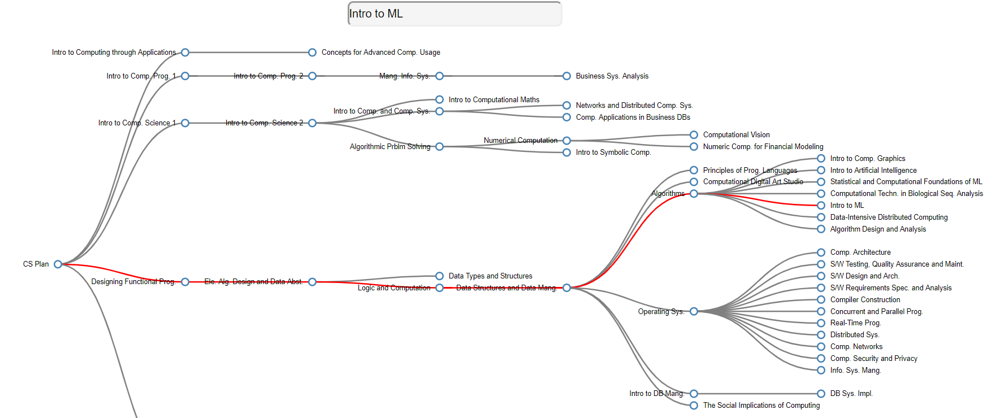

# University Data Visualization

The University Visualization System focuses on analyzing university/school data, its trend over the years, and its course structure. Visual representation about the number of registered students each year, their grades, the distribution of different faculties and professors, their genders, the courses and their prerequisites can be obtained with just a couple of clicks. The statistical data can be visualized in the form of bar charts and donut charts so that they are easy to understand and interpret.

# Data and Technology Used

The entire system has been developed using D3.js (short for Data-Driven Documents) which is a JavaScript library used for creating dynamic and interactive data visualizations on web browsers using HTML5, Scalable Vector Graphics (SVG), and Cascading Style Sheets (CSS) standards. [7]
The system accepts data in the form of JSON and CSV files. Data for the courses and its prerequisites have been scraped from the University of Waterloo’s Computer Science program’s website [8]. All the courses were listed in a tabular format. Tabular data converted into a JSON object which can represent data in the form of a tree. Dummy data has been used for all other visualization modules (faculty and gender data, number of registered students’ data, grades of students in different programs) where random values are used to make the system functioning. The system will work in the same manner if a real-world cleaned dataset is given as an input.

# Module I: Faculty Visualization

The first module of the system visualizes the data of the gender distribution of faculties of different programs, and the faculty designation distribution. The data is represented in the form of simple donut charts. The faculties are categorized into “Male” and “Female” in the first chart, and into “Professor”, “Assistant Professor”, “Associate Professor”, and “Lecturer” in the second chart.
When the mouse hovers over any segment of the donut chart, the percentage value of the faculty is displayed. This distribution is viewed for four programs – Bachelor of Applied CS, Master ofApplied CS, Bachelors of CS, and Masters of CS. As the button for any program is selected, the data is loaded from the JSON object, and displayed on the screen.

# Module II: Students Visualization

This module is used to visualize the yearly data for the number of students enrolled in different programs. The year can be selected from the range slider, and the visualization changes accordingly. If a user clicks on any bar of the bar chart, it shows a donut chart for the distribution of grades of students in that year for that program. The data to the system is fed using CSV files. The colours of the bars change as the data changes. The colours are sorted, i.e. darker the colour, greater the values are.

# Module III: Courses Visualization

The course module of this system creates a tree of courses and its prerequisites based on the JSON data fed to the system. In this case, we used the data collected from the University of Waterloo’s Computer Science program website. This is a collapsible tree structure where the user can hide/show the children nodes by clicking the parent nodes. The user can search for the course or select it from the dropdown menu created using AJAX datalist. The path to the selected course is highlighted in the tree. This feature can help students plan their courses from the earlier semesters itself and will help them pursue the courses of their interest by not missing any prerequisites.

